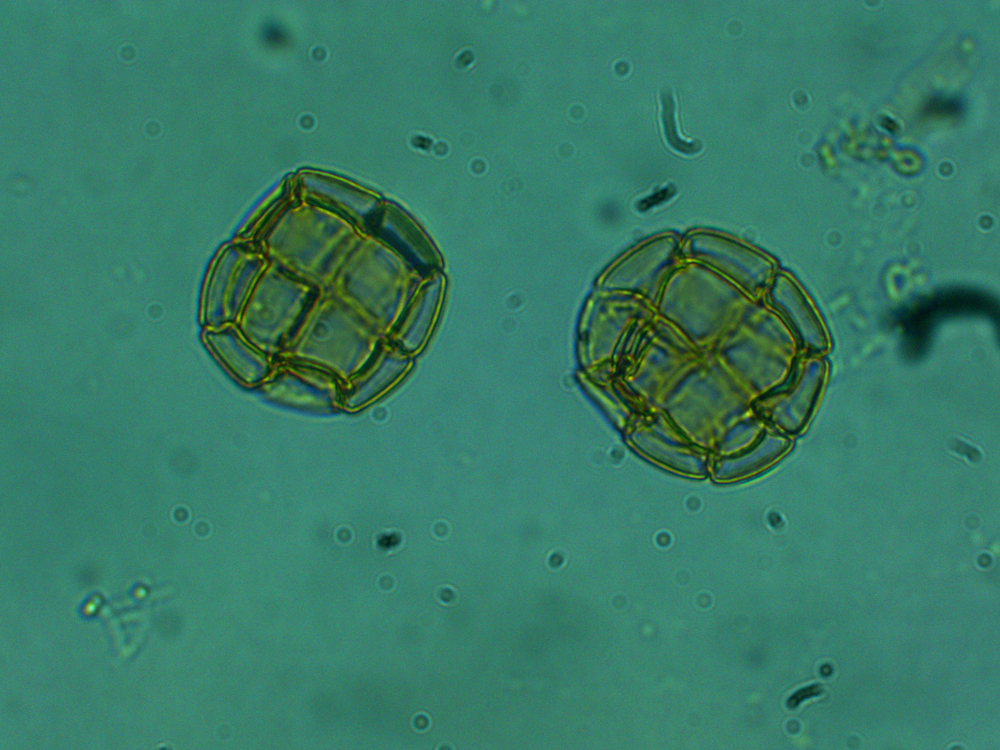
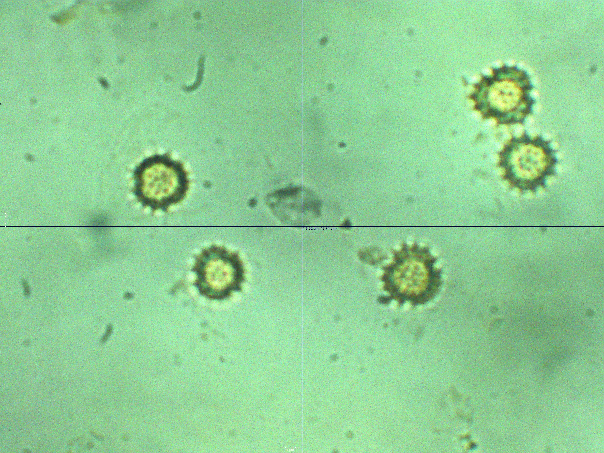
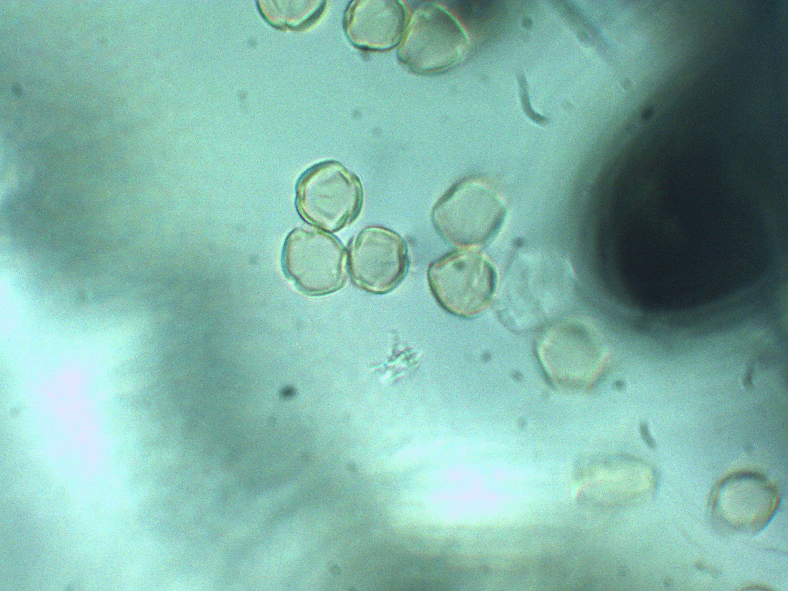
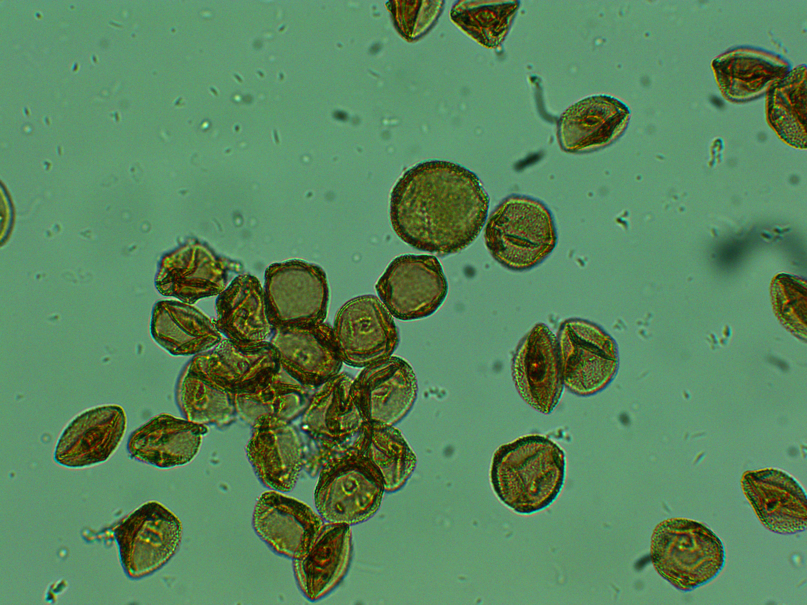

# Yucatan pollen grain dataset

For convenience we've added a script to divide the dataset into training, validation and test subsets run the **divideSets.sh** script, for example:

```sh
./divideSets.sh pathToImages pathTo/obj.names 80 10
```

- The first argument is the path to the images.
- The second argument is the path to the **obj.names** file, which contains the name of the classes.
- The third argument is the percentage of each class to use for the training set.
- The fourth argument is the percentage of each class to use for the validation set (the rest is used for the test set).





*Top left: example of a Box catzín image; top right: example of a Tajonal image; bottom left: example of a Jabín image; bottom right: example of a Chaká image.*
